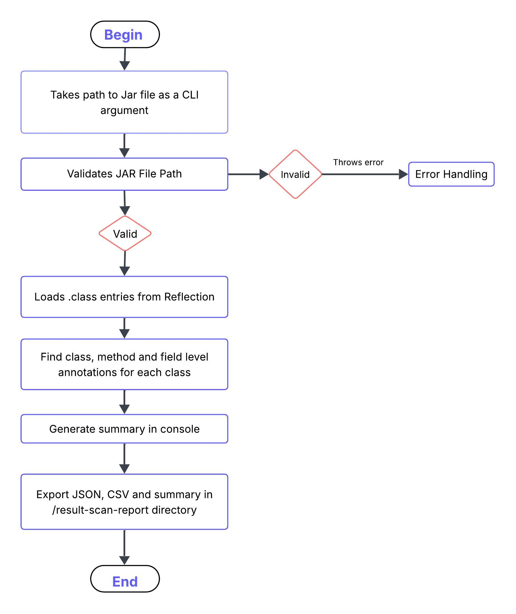

# JAR Annotation Scanner

## Overview

JAR Annotation Scanner is a Java tool that scans any `.jar` file and detects usage of Java annotations.

---

## Features

* Scans `.jar` files for 3 types of annotations
    * Class-level annotations
    * Method-level annotations
    * Field-level annotations

* Outputs reports in CSV, JSON and summary in TXT File formats. Reports are generated under `./result-scan-report/scan-report-<jar-name>/*` directory:
    * `scan-report-<jarname>.json`
    * `scan-report-<jarname>.csv`
    * `scan-report-<jarname>-summary.txt`

---

## Project Structure

```
annotation-scanner/
├── pom.xml
├── README.md
├── src/
│   ├── main/
│   │   └── java/
│   │       └── com/datastealth/
│   │           ├── ScanDriver.java
│   │           ├── scanner/
│   │           │   └── JarAnnotationScanner.java
│   │           ├── model/
│   │           │   ├── AnnotationScanResult.java
│   │           │   └── AnnotationScanResponse.java
│   │           ├── reporter/
│   │           │   ├── AnnotationScanReporter.java
│   │           └── util/
│   │               └── ExportUtil.java
│
│   └── test/
│       └── java/
│           └── com/datastealth/
│               └── AnnotationScannerTest.java
│
│       └── resources/
│           └── sample.jar
```

---
## How to Build

To generate a JAR file with dependencies at target:
```bash
mvn clean package
```

The above command will generate

```pgsql
target/annotation-scanner-1.0-SNAPSHOT-jar-with-dependencies.jar
```

## Sample JAR Files For Test
To test the code, I have shared some sample jar files under **test-jar-files/** directory.
* JAR file with multiple annotations: `sample/target/sample-lib-1.0-SNAPSHOT.jar`
* JAR file with empty/malformed annotations: `sample-empty/target/sample-empty-1.0-SNAPSHOT.jar`
* JAR file with annotations in one class: `sample-annotations/target/sample-annotations-1.0-SNAPSHOT.jar`
* JAR file with nested/partial annotations: `sample-nested/target/sample-nested-1.0-SNAPSHOT.jar`


## How to Run

```pgsql 
java -jar target/annotation-scanner-1.0-SNAPSHOT-jar-with-dependencies.jar <path-to-your-jar-file>
```

### Example Run and Output
* A Run for jar file with multiple annotations
```bash
java -jar target/annotation-scanner-1.0-SNAPSHOT-jar-with-dependencies.jar ./test-jar-files/sample/target/sample-lib-1.0-SNAPSHOT.jar
```

* After running, the output reports are generated as:

```pgsql
result-scan-report/
└──  scan-report-sample-lib-1.0-SNAPSHOT
      ├── scan-report-sample-lib-1.0-SNAPSHOT.json
      ├── scan-report-sample-lib-1.0-SNAPSHOT.csv
      └── scan-report-sample-lib-1.0-SNAPSHOT-summary.txt

```
The directory contains reports CSV and JSON formats, along with a summary in summary.txt.

---

## Error Handling

* If invalid JAR path is provided - Tool will print user-friendly error and exits.
* If a particular class is not getting loaded - skips the class and warning is logged.
* If a JAR is malformed - exception handled using `IOException`.
* If there is no annotation in the file - report is generated with the message.

---

## Edge Cases Covered in The Project
* No jar file is provided or invalid arguments are provided.
* Malformed jar file is provided.
* Empty jar file is provided.
* Malformed annotations in the jar file.
* Nested/Partial annotations in the jar file.

---

## Future Scope

### 1. Multiple JAR Files scanned simultaneously
* **Batch Scanning** multiple JARs in a folder. Multithreading can be used for parallel scanning.

### 2. Maintaining Versions of same JAR Files
* Handling **Versioning** of the exports and retaining the older versions as well by maintaining [overwrite = true/false]

### 3. Interactive interface for the outputs using frontend
* Exporting report to html or excel for better viewing.

### 4. Handling Large Number of Annotations
* For large volumes, streaming, paginated outputs, buffered I/O, or multithreading can be used to optimize class scanning.

---

## Test Cases Covered in the Project

JUnit test cases are written in `/src/test/java/com/datastealth/AnnotationScannerTest`. Below are the covered test scenarios.
* Test with invalid JAR path (throws exception)
* Detect annotations from sample JAR
* Export to JSON, CSV, Summary files correctly
* Test empty class (no annotation)
* Test return message in case No annotations found
* Test malformed annotation file - testing empty files

---
## Flowchart of the Tool

